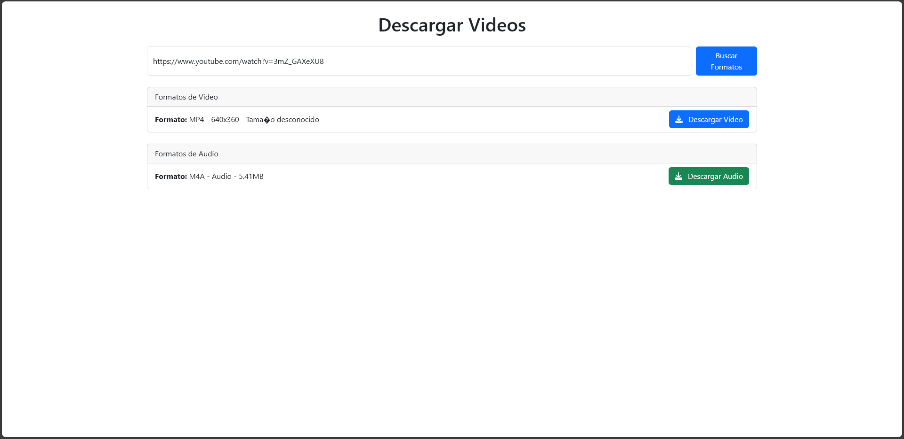

# 📥 Video Downloader

Una aplicación web para descargar videos y audios en diferentes formatos desde una URL. Utiliza `yt-dlp` en el backend y una interfaz moderna en React.

*Puedes probarlo [aquí](https://estrotools.ooguy.com/).*

## 🚀 Características
- Buscar formatos de video y audio desde una URL.
- Descargar videos en formato MP4.
- Descargar audios en formato M4A o MP3.
- Interfaz atractiva y fácil de usar con `React Bootstrap`.

## 🛠️ Tecnologías Usadas
- **Frontend:** React + TypeScript + Bootstrap
- **Backend:** Node.js + Express + yt-dlp
- **Base de datos:** No requiere almacenamiento persistente.
- **Despliegue:** Servidor VPS con HTTPS mediante Let's Encrypt.

## 📦 Instalación
### 1️⃣ Clonar el repositorio
```sh
  git clone https://github.com/tu-repo/video-downloader.git
  cd video-downloader
```

### 2️⃣ Instalar dependencias
#### Backend
```sh
cd backend
npm install
```
#### Frontend
```sh
cd frontend
npm install
```

### 3️⃣ Configurar Variables de Entorno
Crea un archivo `.env` en la carpeta `backend` con las siguientes variables:
```env
PORT=5021
API_BASE_URL=https://estrotools.ooguy.com:5021
```

### 4️⃣ Ejecutar el Proyecto
#### Iniciar el Backend
```sh
cd backend
node back.js
```
#### Iniciar el Frontend
```sh
cd frontend
npm start
```

## 📸 Capturas de Pantalla


## 💡 Uso
1. Ingresa la URL del video.
2. Selecciona el formato deseado (video o audio).
3. Descarga el archivo con un clic.

## 🤝 Contribuciones
¡Se aceptan contribuciones! Para colaborar:
1. Haz un fork del repositorio.
2. Crea una rama nueva (`git checkout -b feature-nueva`).
3. Realiza tus cambios y haz un commit (`git commit -m 'Añadir nueva función'`).
4. Sube los cambios a tu repositorio (`git push origin feature-nueva`).
5. Abre un Pull Request.

## 📜 Licencia
Este proyecto está bajo la licencia **MIT**.

---
📧 Contacto: estrosebas@gmail.com